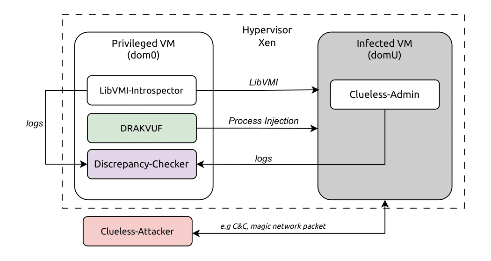

# Rhadamanthus - VMI Linux Rootkit Feature Collection

[](https://www.gnu.org/licenses/lgpl-2.1)
[](https://en.wikipedia.org/wiki/C99)

> Warning: This project is the outcome of an MSc Thesis while being extremely burnout. There may be mistakes, there may be things that are built on wrong assumptions! I still plan to continue working on this project after my submission...

## Overview

A Virtual Machine Introspection (VMI) framework for detecting Linux rootkits and malicious kernel modifications using  [LibVMI](https://libvmi.com/). This project is designed to help with collecting information about potential rootkit indicators on a running virtual machine (DomU) using a privileged virtual machine (Dom0). It can be used as a base later on, to develop a machine learning approach for linux kernel-mode rootkit detection.

🤔 If I had to pitch this, I would say "An amateurish downgraded untested DRAKVUF that focuses in kernel-mode rootkit detection and has a response format I prefer".

## Repository Roadmap

```sh
Rhadamanthus/
├── src/                             # Core source code
│   ├── state_callbacks/             # Periodic analysis tasks
│   ├── event_callbacks/             # Real-time event monitoring
│   ├── config_parser.c              # Configuration parsing
│   ├── event_handler.c              # Event management
│   ├── event_task_map.c             # Event task mapping
│   ├── interrupt_context.c          # Interrupt handling
│   ├── json_serializer.c            # JSON output
│   ├── main.c                       # Main application
│   ├── response.c                   # Response management
│   ├── state_task_map.c             # State task mapping
│   └── utils.c                      # Utility functions
│
├── include/                         # Header files
│   ├── event_callbacks/             # Event callback headers
│   ├── state_callbacks/             # State callback headers
│   ├── offsets.h                    # Kernel structure offsets
│   └── utils.h                      # Utility headers
│
├── config/                         # Configuration files
│   ├── settings_schema.yaml        # Configuration schema
│   ├── libvmi.conf                 # LibVMI configuration
│   ├── linux-5.15.0-139.json       # Kernel symbols and vmlinux data
│   └── Doxyfile                    # Documentation generation
│
├── data/                           # Static data files
│   ├── interrupt_index.linux       # Linux interrupt definitions
│   ├── syscall_index.linux         # System call definitions
│   └── known_files.linux           # Known file signatures
│
├── scenarios/                      # Test scenarios
│   ├── config/                     # Scenario configurations
│   └── Scenarios.md                # Demonstration scenarios
│
├── tests/                          # Test suite
│   ├── poc/                        # Proof of concept code
│   └── test_*.c                    # Unit tests
│
├── scripts/                        # Utility scripts
│   ├── pahole_*.sh                 # Kernel structure analysis
│   └── install_essentials.sh       # Setup scripts
│
├── docs/                           # Documentation
│   └── images/                     # Architecture diagrams
│
├── benchmark/                      # Performance benchmarks
├── CMakeLists.txt                   
├── Makefile                         
├── Setup.md                        # Setup instructions
├── TODO.md                          
└── README.md                        
```


## System

The framework was built and run under the following system specifications:

- **Hypervisor OS**: Debian GNU/Linux 12 (bookworm) x86_64
- **Xen**: xen-hypervisor-4.20.0-debian-bookworm-amd64
- **Drakvuf build**: drakvuf-bundle-1.1-0fa2fd6-debian-bookworm
- **CPU**: Intel(R) Core(TM) i7-8665U (2) @ 2.11 GHz with Intel VT-x enabled
- **DomU VMs OS**: Ubuntu 20.04.6 LTS (Focal Fossa)
- **DomU VMs Kernel version**: 5.15.0-139-generic

For more details, check out [Setup.md](Setup.md).
For demonstrations, check out [Scenarios.md](scenarios/Scenarios.md).

## Architecture

The following figure shows the VMI-Introspector in relation to the whole Experimental Setup as described in the Thesis.

- **[Rhadamanthus (VMI-Introspector)](https://github.com/Mirtia/Rhadamanthus)**: Performs live introspection to collect information about machine integrity and detect events associated with rootkit behavior.
- **[Drakvuf](https://github.com/tklengyel/drakvuf)**: Used to inject the modules and processes to the infected VM to mark the start of the infection phase and start the Cluless-Admin monitor. 
- **[Clueless-Admin](https://github.com/Mirtia/Clueless-Admin)**: A baseline in-guest monitoring toolkit for rootkit detection.
- **[Clueless-Attacker](https://github.com/Mirtia/Clueless-Attacker)**: A list of actions that imitate attacker post-infection behavior.
- **[Discrepancy-Checker](https://github.com/Mirtia/Discrepancy-Checker)**: A simple JSON comparison implementation to observe discrepancies (wherever possible) between **in-guest** monitoring and **privileged VM** hypervisor based monitoring.



## Quick Start

### Installation

1. **Clone the repository**
   ```bash
   git clone https://github.com/Mirtia/Rhadamanthus.git
   cd Rhadamanthus
   ```

2. **Install dependencies**
   ```bash
   # Install Conan (if not already installed)
   pip install conan
   # Warning! glib is not pulled with conan. Install libglib2.0-dev in your system.

   # Install project dependencies
   make build
   ```

3. **Configure LibVMI**
   ```bash
   # Edit /etc/libvmi.conf to include your VM domain
   sudo nano /etc/libvmi.conf
   ```

4. **Create configuration file**
   ```bash
   cp config/settings_schema.yaml custom_config.yaml
   # Edit custom_config.yaml with your VM domain name
   ```

5. **Run the introspector**
   ```bash
   ./build/introspector -c custom_config.yaml
   ```

## Configuration

The project uses YAML configuration files to specify monitoring parameters and detection features.

### Basic Configuration

```yaml
# VM domain name (must match LibVMI configuration)
domain_name: "ubuntu-20-04-new-kernel"

# Monitoring parameters
monitor:
  window_seconds: 10      # Total monitoring window (10 seconds)
  state_sampling_seconds: 1 # State polling interval (1 second)

# Detection features
features:
  state:
    - id: STATE_FTRACE_HOOKS      # Detect ftrace-based hooks
    - id: STATE_SYSCALL_TABLE     # Monitor syscall table integrity
    - id: STATE_NETWORK_TRACE     # Analyze network connections
  
  event:
    - id: EVENT_FTRACE_HOOK       # Real-time ftrace hook detection
  
  interrupt:
    - id: INTERRUPT_KPROBE        # Traditional kernel hooks monitoring
    - id: INTERRUPT_EBPF_TRACEPOINT # eBPF tracepoint programs monitoring
```

### Available Detection Features

#### 🔍 State Tasks (Periodic Analysis)
| Feature | Description | Implementation | Status/Notes |
|---------|-------------|----------------|--------------|
| `STATE_FTRACE_HOOKS` | Detects ftrace-based function hooks | [`src/state_callbacks/ftrace_hooks.c`](src/state_callbacks/ftrace_hooks.c) | ✅ **Complete** - Information derived from state callback |
| `STATE_SYSCALL_TABLE` | Monitors syscall table integrity | [`src/state_callbacks/syscall_table.c`](src/state_callbacks/syscall_table.c) | ✅ **Complete** |
| `STATE_IDT_TABLE` | Monitors Interrupt Descriptor Table integrity | [`src/state_callbacks/idt_table.c`](src/state_callbacks/idt_table.c) | ✅ **Complete** |
| `STATE_KERNEL_MODULE_LIST` | Analyzes loaded kernel modules | [`src/state_callbacks/kernel_module_list.c`](src/state_callbacks/kernel_module_list.c) | ⚠️ **Limitation**: Does not detect hidden modules - requires sophisticated RB tree traversal approach |
| `STATE_NETWORK_TRACE` | Monitors network connections and hooks | [`src/state_callbacks/network_trace.c`](src/state_callbacks/network_trace.c) | ✅ **Complete** - Focuses on established connections only |
| `STATE_EBPF_ARTIFACTS` | Detects eBPF programs and maps | [`src/state_callbacks/ebpf_activity.c`](src/state_callbacks/ebpf_activity.c) | ✅ **Complete** |
| `STATE_IO_URING_ARTIFACTS` | Monitors io_uring structures | [`src/state_callbacks/io_uring_artifacts.c`](src/state_callbacks/io_uring_artifacts.c) | ✅ **Complete** - Does not show extensive information |
| `STATE_MSR_REGISTERS` | Monitors Model Specific Registers | [`src/state_callbacks/msr_registers.c`](src/state_callbacks/msr_registers.c) | ⚠️ **Not fully tested** |
| `STATE_PROCESS_LIST` | Analyzes running processes | [`src/state_callbacks/process_list.c`](src/state_callbacks/process_list.c) | ✅ **Complete** |
| `STATE_KALLSYMS_SYMBOLS` | Monitors kernel symbol table | [`src/state_callbacks/kallsyms_symbols.c`](src/state_callbacks/kallsyms_symbols.c) | ✅ **Complete** |
| `STATE_DIR_STRING_MATCHING` | String matching in directories | [`src/state_callbacks/dir_string_matching.c`](src/state_callbacks/dir_string_matching.c) | ⚠️ **TODO**: Not high priority |

#### ⚡ Event Tasks (Real-time Monitoring)
| Feature | Description | Implementation | Status/Notes |
|---------|-------------|----------------|--------------|
| `EVENT_FTRACE_HOOK` | Real-time ftrace hook detection | [`src/event_callbacks/ftrace_hook.c`](src/event_callbacks/ftrace_hook.c) | ✅ **Complete** - Information derived from state callback |
| `EVENT_SYSCALL_TABLE_WRITE` | Syscall table modification events | [`src/event_callbacks/syscall_table_write.c`](src/event_callbacks/syscall_table_write.c) | ✅ **Complete** |
| `EVENT_IDT_WRITE` | IDT modification detection | [`src/event_callbacks/idt_write.c`](src/event_callbacks/idt_write.c) | ✅ **Complete** |
| `EVENT_CR0_WRITE` | CR0 register modification detection | [`src/event_callbacks/cr0_write.c`](src/event_callbacks/cr0_write.c) | ✅ **Complete** |
| `EVENT_MSR_WRITE` | MSR monitoring | [`src/event_callbacks/msr_write.c`](src/event_callbacks/msr_write.c) | ⚠️ **Not fully tested** |
| `EVENT_CODE_SECTION_MODIFY` | Code section modification detection | [`src/event_callbacks/code_section_modify.c`](src/event_callbacks/code_section_modify.c) | ✅ **Complete** |
| `EVENT_PAGE_TABLE_MODIFICATION` | Page table modification detection | [`src/event_callbacks/page_table_modification.c`](src/event_callbacks/page_table_modification.c) | ✅ **Complete** |
| `EVENT_KALLSYMS_TABLE_WRITE` | Kernel symbol table modification | [`src/event_callbacks/kallsyms_table_write.c`](src/event_callbacks/kallsyms_table_write.c) | ✅ **Complete** |

#### 🚨 Interrupt Tasks (Breakpoint Monitoring)
| Feature | Description | Implementation | Status/Notes |
|---------|-------------|----------------|--------------|
| `INTERRUPT_KPROBE` | Traditional kernel hooks monitoring (kprobe, uprobe, tracepoint_probe_register) | [`src/event_callbacks/kprobe.c`](src/event_callbacks/kprobe.c) | ✅ **Complete** |
| `INTERRUPT_EBPF_TRACEPOINT` | eBPF tracepoint programs monitoring (bpf_prog_attach, bpf_raw_tracepoint_open, fmod_ret) | [`src/event_callbacks/ebpf_tracepoint.c`](src/event_callbacks/ebpf_tracepoint.c) | ✅ **Complete** |
| `INTERRUPT_IO_URING_RING_WRITE`  | io_uring detection on invocation of `__x64_sys_io_uring_enter` | [`src/event_callbacks/io_uring_ring_write.c`](src/event_callbacks/io_uring_ring_write.c) | ✅ **Complete** - Does not show extensive information |
| `INTERRUPT_NETWORK_MONITOR` | Comprehensive network monitoring (sockets, ports, connections, netfilter hooks) | [`src/event_callbacks/network_monitor.c`](src/event_callbacks/network_monitor.c) | ✅ **Complete** |

## Response Format

The introspector generates structured JSON output following [Google's response schema](https://google.github.io/styleguide/jsoncstyleguide.xml). The following example is the result of `STATE_SYSCALL_TABLE` callback. The full list of results is emitted.

```json
{
	"timestamp":	"2025-09-12T14:30:50.106260",
	"status":	"SUCCESS",
	"metadata":	{
		"task_type":	"STATE",
		"subtype":	"STATE_SYSCALL_TABLE"
	},
	"data":	{
		"syscall_table":	{
			"kernel_range":	{
				"start":	"0xffffffff8ee00000",
				"end":	"0xffffffff8fe02402"
			},
			"syscall_table":	{
				"address":	"0xffffffff90000320",
				"total_syscalls":	300
			},
			"syscalls":	[{
					"index":	0,
					"name":	"read",
					"address":	"0xffffffff8f193190",
					"is_hooked":	false
				}, {
					"index":	1,
					"name":	"write",
					"address":	"0xffffffff8f1932c0",
					"is_hooked":	false
				}, {
					"index":	299,
					"name":	"recvmmsg",
					"address":	"0xffffffff8f8b5e90",
					"is_hooked":	false
				}],
			"summary":	{
				"total_hooked_syscalls":	0
			}
		}
	}
}

```

## License

This project is licensed under the GNU Lesser General Public License v2.1 - see the [LICENSE](LICENSE) file for details.

## Citation

If you use this project in your research, please cite it as:

```bibtex
@software{rhadamanthus,
  title={Rhadamanthus},
  author={Gkolemi, Myrsini},
  year={2025},
  url={https://github.com/Mirtia/Rhadamanthus},
  license={LGPL-2.1}
}
```

## Acknowledgments

This project incorporates code examples and techniques from the following open-source repositories:

- **[LibVMI](https://github.com/libvmi/libvmi)** - Virtual Machine Introspection library `/examples`
- **[Cloud_Integrity](https://github.com/tianweiz07/Cloud_Integrity)** - Rootkit detection using LibVMI.


## AI usage

Generative AI was used for the creation of boilerplate e.g response management and logging information, scripting and doxygen documentation.