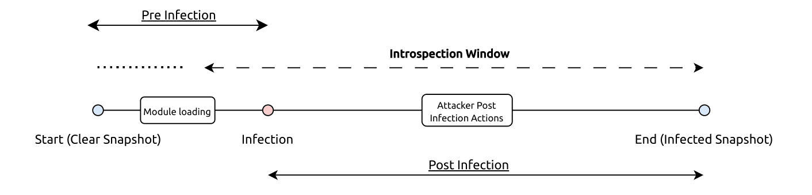

# Details

## Prerequisites (Preparation)

- First, I created a VM and run the kernel debug script and install essentials script from the scripts folder:

```sh
# Install kernel debug symbols
sudo ./kernel_install_dbg.sh

# Install essential development tools
sudo ./scripts/install_essentials.sh --basics --net --bpf --uv --liburing --go --clang14
``` 

- Then I copied the logical volume (created clones) so I could run the scenarios. Keep in mind to always keep a clean copy.

```sh
# Where `if` stands for input and `of` for output, check the checksums (optional)
# ea6e8a055094176948978b5a344f8a1c  /dev/vg/linux-test
# ea6e8a055094176948978b5a344f8a1c  /dev/vg/linux-placeholder
sudo dd if=/dev/vg/linux-test of=/dev/vg/linux-placeholder bs=4M status=progress
```

- Finally, experiment!

For each experiment, DRAKVUF will be used to load both the rootkit module and start the Clueless Admin monitoring tool. This is accomplished by injecting the processes into the target VM, which provides convenient timing control for the experiments. While this approach deviates from the typical DRAKVUF usage pattern, the process injection capability makes it ideal for managing the timing window required for these tests. The [`prepare_scenario.sh`](prepare_scenario.sh) script does exactly those steps.

Below it's roughlty the idea behind the time window approach.



The Clueless Admin tool writes its monitoring logs to `/tmp` by default. During development, I encountered some challenges with how DRAKVUF parses arguments for process injection, so I created a single `--all` flag for Clueless Admin that enables all monitoring options simultaneously.

The VMI introspector operates with a tolerance window, starting slightly before Clueless-Admin begins execution and continuing a bit after it completes. This ensures coverage of the monitoring period and captures the *full* scope of rootkit behavior.


